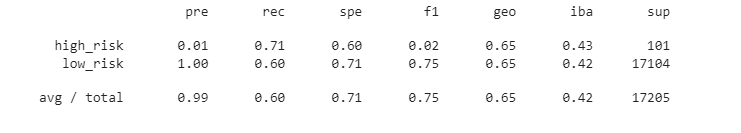
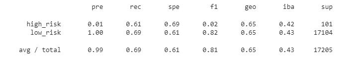
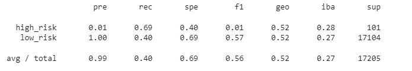
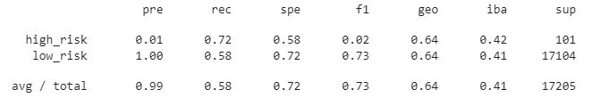
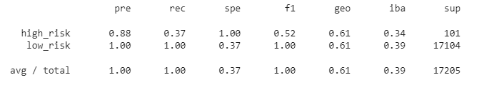
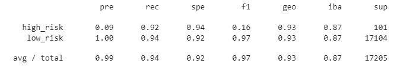

# Credit_Risk_Analysis

## Overview of Project
 
### Purpose

The purpose of the project is to evaluate the performance of 6 different supervised machine learning models to predict credit risk.

## Results

- Naive Random Oversampling

The balanced accuracy score is .66. The precision for predicting high risk is .01 with a recall of .71. The precision for predicting low risk is 1 with a recall of .60.

- SMOTE Oversampling

The balanced accuracy score is .65. The precision for predicting high risk is .01 with a recall of .61. The precision for predicting low risk is 1 with a recall of .69.

- Cluster Centroids

The balanced accuracy score is .54. The precision for predicting high risk is .01 with a recall of .69. The precision for predicting low risk is 1 with a recall of .40.

- SMOTEENN

The balanced accuracy score is .65. The precision for predicting high risk is .01 with a recall of .72. The precision for predicting low risk is 1 with a recall of .72.

- Balanced Random Forest Classifier

The balanced accuracy score is .68. The precision for predicting high risk is .88 with a recall of .37. The precision for predicting low risk is 1 with a recall of 1.

- Easy Ensemble AdaBoost Classifier 

The balanced accuracy score is .93. The precision for predicting high risk is .09 with a recall of .92. The precision for predicting low risk is 1 with a recall of .94.

## Summary

All models except for the Random Forest Classifier have poor precision scores when predicting high risk. AdaBoost Classifier had the best recall score when predicting high risk. The only model with a moderate f1 score when predicting high risk is the Random Forest Classifier. The Random Forest Classifier is the only model that should be used since it has the best f1 score.
